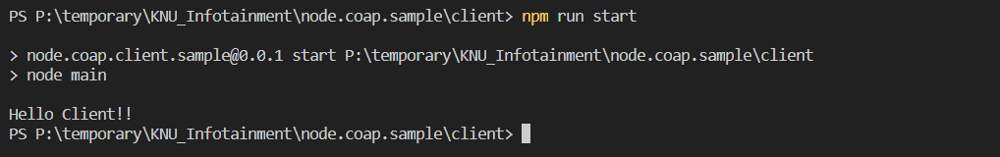

# CoAP Server 실행법

* node.coap.sample/server 디렉터리로 이동해주세요

* `npm install` 명령어를 통해 패키지를 설치해주세요

* 설치가 완료되면 `npm run start` 명령어 또는 `node main` 명령어를 통해 서버를 실행할 수 있습니다.

* 아래와 같은 화면이 나오면 서버가 정상적으로 작동하는 겁니다.

  

# CoAP Client 실행법

* Server와 같은 방식으로 Client를 실행할 수 있습니다.
* 아래와 같은 화면이 나오면 정상적으로 Client가 작동한 겁니다.
* 

본 시나리오에서는 Client가 서버에 Hello Server!! 를 전달하고 Server가 Client에게 응답으로 Hello Client를 전달합니다.

더욱 자세한 내용은 아래의 링크를 참조해주세요~

# Refference Link

* https://www.npmjs.com/package/coap#outgoing
* https://www.npmjs.com/package/coap-router

